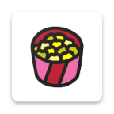

# Hi, I'm Moro 👏👨‍💻

### About Me

I am a Catholic Christian ✝️. I play the acoustic guitar 🎸 and brazilian viola🎻. I have three beautiful guinea pigs 🐷.
I live in Porto Alegre 🇧🇷, where I've worked in the software industry since 2017.

Primary, I'm 🤖 Android Developer 💚, but I'm also skilled in back-end development with NodeJS.

## Personal Projects

<table style="overflow-x:auto;">
  <tr>
    <td>
      
    </td>
    <td>
      

        <a href=https://github.com/gabrielbmoro/MovieDB-Android>Movie DB - Android</a> provides an Android project that uses the library Movie DB AP
      

    </td>
  </tr>
    <tr>
      <td>
        
      </td>
      <td>
        

          <a href="https://github.com/gabrielbmoro/CrazyMath-Android">CrazyMath - Android</a> is a project for children to practice mathematics as the game. I thought this Idea when I remember of Cross-words, but I change it to be a kind of Cross-numbers game.
        

      </td>
    </tr>
</table>
