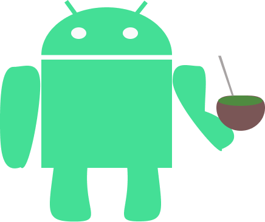

# Olá, sou o Moro 🇧🇷

### Sobre mim

Eu sou Cristão ✝️. Toco violão 🎸 e viola caipira🎻. Tenho oito porquinhos da índia lindos 🐷.
Eu moro em Viamão🇧🇷, trabalho como 🤖 Desenvolvedor Android 💚 desde 2017.

## Projetos Pessoais

<table style="overflow-x:auto;">
   <tr>
      <td>
         
      </td>
      <td>
         

            <a href=https://github.com/gabrielbmoro/MovieDB-Android>Movie DB - Android</a> utiliza como serviço a API Movie DB AP
         

      </td>
   </tr>
   <tr>
      <td>
         
      </td>
      <td>
         

            <a href="https://github.com/gabrielbmoro/CrazyMath-Android">CrazyMath - Android</a> é um projeto para crianças aprenderem matemática através de jogos. A ideia é baseada no jogo de caça-palavras, um tipo de caça-números.
         

      </td>
   </tr>
   <tr>
      <td>
         
      </td>
      <td>
         <a href="https://github.com/gabrielbmoro/slides-about-android-development">Slides about Android Development</a> é um projeto para compartilhar conteúdo sobre desenvolvimento Android utilizando personagens de séries e filmes.
      </td>
   </tr>
   <tr>
      <td>
         
      </td>
      <td>
         <a href="https://github.com/gabrielbmoro/record-demo">Record-demo</a> é um projeto para conhecer os recursos nativos do Android para gravar e executar audios.
      </td>
   </tr>
   <tr>
      <td>
         
      </td>
      <td>
         

            <a href=https://github.com/gabrielbmoro/httpguineapigscode>Guinea pigs HTTP Codes</a> é um projeto divertido que mostra diferentes HTTP codes com porquinhos da índia.
      </td>
   </tr>
</table>
